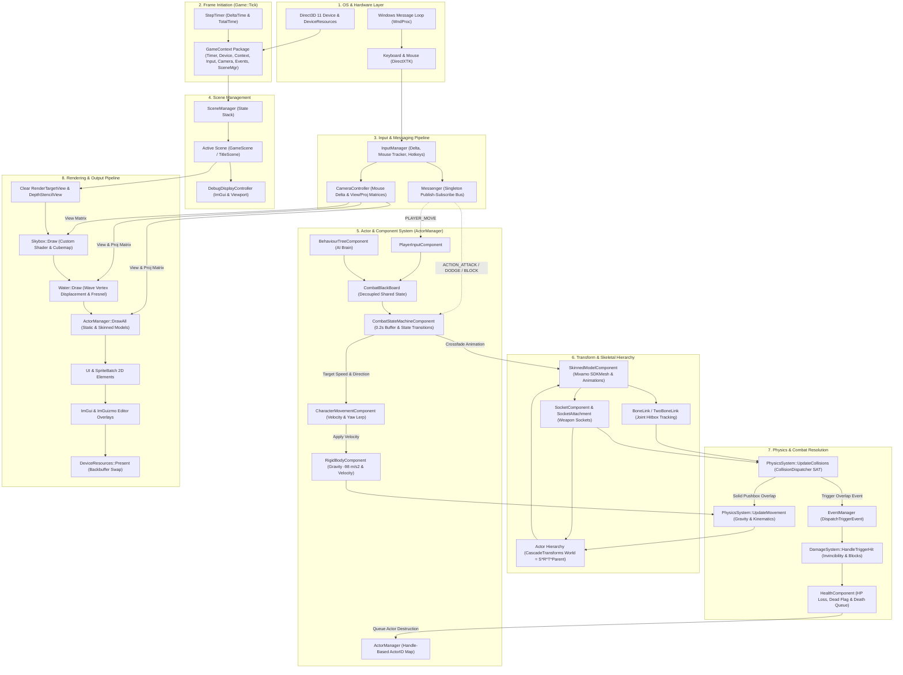
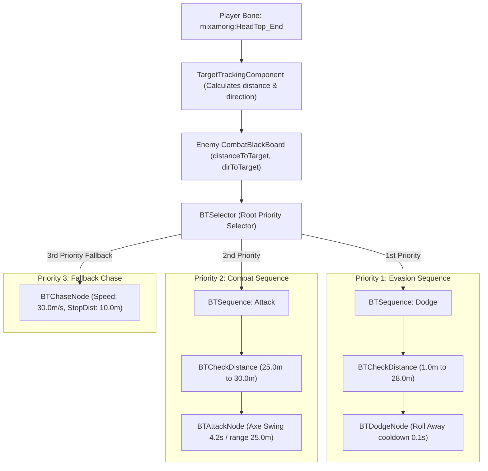
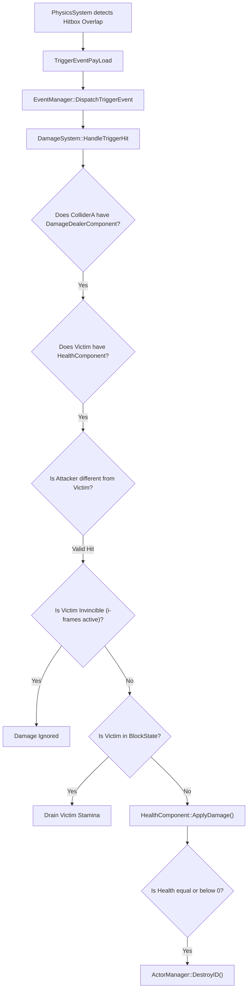

# HEIN Engine & Dual — Comprehensive Data Flow, Architecture & System Engineering Specification

This document provides an exhaustive, production-grade technical specification for the **HEIN Engine** and the **Dual** action RPG game. It details the memory hierarchy, frame execution order, decoupled messaging architecture, finite state machines, AI behaviour trees, skeletal bone/socket synchronisation, physics SAT math, Direct3D 11 HLSL rendering pipeline, and scene serialization.

---

## Table of Contents

1. [High-Level Architectural Overview](#1-high-level-architectural-overview)
2. [Deterministic Frame Lifecycle & Execution Sequence](#2-deterministic-frame-lifecycle--execution-sequence)
3. [Actor & Component Memory Hierarchy](#3-actor--component-memory-hierarchy)
4. [Player Combat State Machine & Input Buffering](#4-player-combat-state-machine--input-buffering)
5. [Enemy Boss AI & Behaviour Tree Architecture](#5-enemy-boss-ai--behaviour-tree-architecture)
6. [Skeletal Animation, Bone Linking & Socket Hierarchy](#6-skeletal-animation-bone-linking--socket-hierarchy)
7. [Physics, Collision SAT & Mathematical Geometry](#7-physics-collision-sat--mathematical-geometry)
8. [Combat Damage Resolution & Health Subsystem](#8-combat-damage-resolution--health-subsystem)
9. [Camera Subsystem & Multi-Mode Transition Stack](#9-camera-subsystem--multi-mode-transition-stack)
10. [Environment, Procedural Water & DirectX 11 HLSL Pipeline](#10-environment-procedural-water--directx-11-hlsl-pipeline)
11. [Persistence, JSON Serialization & Level Editor Pipeline](#11-persistence-json-serialization--level-editor-pipeline)
12. [Master Component & Class Dictionary](#12-master-component--class-dictionary)

---

## 1. High-Level Architectural Overview

HEIN Engine is a high-performance, modular Direct3D 11 engine engineered specifically for third-person action combat games. The architecture prioritizes **deterministic execution**, **decoupled communication via Publish-Subscribe messaging**, and **joint-accurate physics and combat hitboxes**.



---

## 2. Deterministic Frame Lifecycle & Execution Sequence

To prevent 1-frame latency between animations, physics collisions, and rendering, `Game::Tick()` follows a strict 5-phase sequential execution contract:

```mermaid
sequenceDiagram
    autonumber
    participant Win as Windows OS / Input
    participant Game as Game (Game.cpp)
    participant Scene as GameScene
    participant Input as InputManager & Messenger
    participant Actors as ActorManager
    participant Phys as PhysicsSystem
    participant Math as Skeletal / BoneLink / Sockets
    participant Damage as DamageSystem
    participant GPU as Direct3D 11 GPU

    Win->>Game: Mouse & Keyboard Window Messages
    Game->>Input: Update trackers & calculate mouse delta
    Game->>Scene: Update(GameContext)

    rect rgb(15, 23, 42)
        Note over Scene,Actors: Phase A: Input Broadcasting & State Machine Updates
        Scene->>Input: BroadCastPlayerInput(PlayerID)
        Input->>Actors: Messenger notifies PlayerInput & CombatStateMachine
        Scene->>Actors: UpdateAll(deltaTime) [AI BT & FSM Tick]
    end

    rect rgb(20, 35, 30)
        Note over Scene,Phys: Phase B: Physics Movement & Kinematics
        Scene->>Phys: UpdateMovement(deltaTime)
        Phys->>Actors: Apply Gravity (-98 m/s2) & Velocity to Transforms
    end

    rect rgb(35, 25, 45)
        Note over Scene,Math: Phase C: Transform Cascading & Skeletal Animation
        Scene->>Actors: UpdateAllHierarchies() [CascadeTransforms]
        Actors->>Math: Update Bone Matrices to Reposition BoneLinks & Sockets
        Scene->>Actors: LateUpdateAll(deltaTime)
    end

    rect rgb(45, 20, 25)
        Note over Scene,Damage: Phase D: Collision SAT & Combat Hitbox Resolution
        Scene->>Phys: UpdateCollisions(deltaTime) [CollisionDispatcher SAT]
        Phys->>Damage: Dispatch Trigger Hit to DamageDealer and Health
        Damage->>Actors: Apply damage, trigger invincibility, queue dead actors
        Scene->>Actors: CleanUpDestroyedActors() [Safe end-of-frame deletion]
    end

    rect rgb(15, 30, 50)
        Note over Scene,GPU: Phase E: Direct3D 11 Render Pass & ImGui Overlay
        Game->>GPU: Clear RenderTargetView & DepthStencilView
        Scene->>GPU: Draw Skybox, Water, 3D Static & Skinned Models, 2D UI
        Scene->>GPU: Draw DebugDisplayController (ImGui & ImGuizmo Overlays)
        Game->>GPU: DeviceResources::Present() [Swapchain Flip]
    end
```



### Phase Execution Breakdown

| Phase | Subsystem Routine | Technical Operations |
| :--- | :--- | :--- |
| **Phase A** | `BroadCastPlayerInput()` & `UpdateAll()` | Broadcasts WASD, attacks, dodges via `Messenger`. Evaluates AI `BTSelector` branches. Computes 200ms input buffers and updates FSM state. |
| **Phase B** | `PhysicsSystem::UpdateMovement()` | Integrates kinematic velocities, applies acceleration and gravity ($-98\text{ m/s}^2$). Updates actor `TransformComponent` coordinates. |
| **Phase C** | `UpdateAllHierarchies()` & `LateUpdateAll()` | Traverses parent-child scene graph ($S \times R \times T \times \text{Parent}$). Evaluates Mixamo bone palettes and syncs dynamic `TwoBoneLink` & `SocketAttachment` matrices. |
| **Phase D** | `PhysicsSystem::UpdateCollisions()` | Executes SAT 15-axis OBB tests, Capsule segment math, resolves solid pushbox penetration via MTV, and triggers `DamageSystem::HandleTriggerHit()`. |
| **Phase E** | `ActorManager::DrawAll()` & `Present()` | Clears buffers, renders Skybox, animated Water, 3D skinned models, 2D sprites, ImGui/ImGuizmo debug viewport, and flips DXGI swapchain. |

---

## 3. Actor & Component Memory Hierarchy

The engine utilizes a handle-based memory layout. Pointers to `Actor` objects are not stored directly in other systems; instead, `ActorID` (uint32_t) integers are passed.

- **`ActorManager`:** Primary storage container holding `std::unordered_map<ActorID, std::unique_ptr<Actor>>`.
- **`IComponent`:** Base component class with `Init()`, `Update(dt)`, `LateUpdate(dt)`, `Draw()`, `Serialize()`, `Deserialize()`.
- **Hierarchy Graph:** An `Actor` maintains a parent `ActorID` and a list of children `std::vector<ActorID>`. Calling `CascadeTransforms()` recursively recomputes world matrices down the tree.

### World Matrix Composition Formula

$$\mathbf{M}_{\text{local}} = \mathbf{S} \cdot \mathbf{R}_{\text{quat}} \cdot \mathbf{T}$$

$$\mathbf{M}_{\text{world}} = \begin{cases} \mathbf{M}_{\text{local}} & \text{if parent is Root (0)} \\ \mathbf{M}_{\text{local}} \cdot \mathbf{M}_{\text{parent\_world}} & \text{if parent exists} \end{cases}$$

---

## 4. Player Combat State Machine & Input Buffering

The combat system implements a responsive Finite State Machine (`CombatStateMachineComponent`) powered by an input queue buffer (200ms) and multi-stage attack combo windows.

```mermaid
flowchart TD
    S_Idle["IdleState (moveSpeed = 0)"]
    S_Walk["WalkState (moveSpeed = 30)"]
    S_Attack["OneHandAttackState (Combo Stages 1, 2, 3)"]
    S_Dodge["DodgeState (Direction lock & i-frames)"]
    S_Strafe["StrafeState (Orbit target left/right)"]
    S_Block["BlockState (Invincible shield & stamina drain)"]

    S_Idle -->|OnMove| S_Walk
    S_Idle -->|OnAttack| S_Attack
    S_Idle -->|OnDodge| S_Dodge
    S_Idle -->|OnBlock| S_Block
    S_Idle -->|OnStrafe| S_Strafe

    S_Walk -->|OnStop| S_Idle
    S_Walk -->|OnAttack| S_Attack
    S_Walk -->|OnDodge| S_Dodge
    S_Walk -->|OnBlock| S_Block

    S_Attack -->|Combo End / OnStop| S_Idle
    S_Attack -->|Buffered Dodge| S_Dodge
    S_Attack -->|Combo Advance Stage 1 to 2 to 3| S_Attack

    S_Dodge -->|Timer over 0.6s / OnStop| S_Idle
    S_Dodge -->|OnMove| S_Walk

    S_Block -->|Release RMB / OnStop| S_Idle
    S_Block -->|Stamina Depleted (Guard Break)| S_Idle
```

### Attack Combo Windows

| Combo Stage | Window Start ($t_{\text{start}}$) | Window End ($t_{\text{end}}$) | Animation Clip | Action |
| :--- | :--- | :--- | :--- | :--- |
| **Stage 1 (Slash)** | `1.20s` | `1.60s` | `swing.sdkmesh_anim` | Standard horizontal blade strike. |
| **Stage 2 (Cross)** | `2.20s` | `2.40s` | `swing.sdkmesh_anim` | Fast returning slash. |
| **Stage 3 (Heavy)** | `4.20s` | `4.50s` | `swing.sdkmesh_anim` | High-damage overhead smash. |

---

## 5. Enemy Boss AI & Behaviour Tree Architecture

The Boss AI relies on a priority-based Behaviour Tree decoupled from internal state via `CombatBlackBoard`.



### Distance Evaluation Logic

$$\mathbf{d} = \mathbf{p}_{\text{player}} - \mathbf{p}_{\text{enemy}}, \quad d = \|\mathbf{d}\|, \quad \hat{\mathbf{u}} = \frac{\mathbf{d}}{d}$$

1. **If $1.0\text{ m} \le d \le 28.0\text{ m}$:** Executes `BTDodgeNode`.
2. **If $28.0\text{ m} < d \le 30.0\text{ m}$:** Executes `BTAttackNode`.
3. **If $d > 30.0\text{ m}$:** Executes `BTChaseNode` ($v = 30.0\text{ m/s}$).

---

## 6. Skeletal Animation, Bone Linking & Socket Hierarchy

To guarantee exact hitbox precision without loose approximations:

- **Single Joint Linking (`BoneLinkComponent`):** Anchors a sphere or capsule collider (e.g. Head) directly to bone world coordinates:
  $$\mathbf{p}_{\text{head}} = \mathbf{M}_{\text{head\_bone}} \cdot \mathbf{p}_{\text{local}}$$
- **Dual Joint Spanning (`TwoBoneLinkComponent`):** Dynamically computes capsule midpoint, length, and orientation between two skeletal joints:
  $$\mathbf{c} = \frac{\mathbf{v}_1 + \mathbf{v}_2}{2}, \quad h = \|\mathbf{v}_2 - \mathbf{v}_1\|, \quad \mathbf{q} = \text{FromToRotation}((0,1,0), \frac{\mathbf{v}_2 - \mathbf{v}_1}{h})$$
- **Weapon Socket System (`SocketComponent` & `SocketAttachmentComponent`):** Weapons follow the hand bone socket matrix:
  $$\mathbf{M}_{\text{weapon\_world}} = \mathbf{M}_{\text{socket\_offset}} \cdot \mathbf{M}_{\text{hand\_bone}} \cdot \mathbf{M}_{\text{character\_world}}$$

---

## 7. Physics, Collision SAT & Mathematical Geometry

The collision engine separates **Solid Pushboxes** (kinematic barrier separation) from **Trigger Hitboxes** (combat damage dispatch).

### Separating Axis Theorem (SAT) 15-Axis Test for OBBs

For boxes $A$ and $B$ with axes $\{\mathbf{u}_A^0, \mathbf{u}_A^1, \mathbf{u}_A^2\}$ and $\{\mathbf{u}_B^0, \mathbf{u}_B^1, \mathbf{u}_B^2\}$:

1. **Axes 1–3:** $\mathbf{u}_A^0, \mathbf{u}_A^1, \mathbf{u}_A^2$ (Face normals of Box A)
2. **Axes 4–6:** $\mathbf{u}_B^0, \mathbf{u}_B^1, \mathbf{u}_B^2$ (Face normals of Box B)
3. **Axes 7–15:** $\mathbf{u}_A^i \times \mathbf{u}_B^j$ (9 Cross products of box edges)

### Collision Layer Bitmask Matrix

| Layer | Bitmask | Collides With (Collision Mask) |
| :--- | :--- | :--- |
| `Layer_Player` | `0x0001` | `Layer_Environment`, `Layer_Enemy`, `Layer_EnemyWeapon` |
| `Layer_Enemy` | `0x0002` | `Layer_Environment`, `Layer_Player`, `Layer_PlayerWeapon` |
| `Layer_PlayerWeapon` | `0x0004` | `Layer_Enemy`, `Layer_EnemyWeapon` |
| `Layer_EnemyWeapon` | `0x0008` | `Layer_Player`, `Layer_PlayerWeapon` |
| `Layer_Environment` | `0x0010` | `Layer_Player`, `Layer_Enemy` |

---

## 8. Combat Damage Resolution & Health Subsystem



---

## 9. Camera Subsystem & Multi-Mode Transition Stack

`CameraController` provides smooth mode transitions via quaternion spherical linear interpolation (Slerp) and Hermite position curves:

1. **`ThirdPersonMode`:** Spherical coordinates $(r, \theta, \phi)$ orbiting player with shoulder offset.
2. **`FirstPersonMode`:** Bound directly to `mixamorig:HeadTop_End` joint.
3. **`SpringCameraMode`:** Raycast environment occlusion testing to prevent clipping into terrain geometry.
4. **`LockOnCameraMode`:** Framed midpoint between Player and Boss:
   $$\mathbf{p}_{\text{mid}} = \frac{\mathbf{p}_{\text{player}} + \mathbf{p}_{\text{boss}}}{2}$$
5. **`DebugCameraMode`:** 6-DOF free fly WASD navigation with mouse look.

---

## 10. Environment, Procedural Water & DirectX 11 HLSL Pipeline

### Procedural Water Waves (`WaterVs.hlsl`)

$$y(x, z, t) = A \cdot \sin(k_x x + \omega t) \cdot \cos(k_z z + 0.8\omega t)$$

### Fresnel & Normal Map Synthesis (`WaterPs.hlsl`)

$$\mathbf{N} = \text{normalize}\left(\mathbf{N}_1(u + v_1 t) + \mathbf{N}_2(u - v_2 t)\right)$$

$$F = F_0 + (1 - F_0)(1 - \mathbf{V} \cdot \mathbf{N})^5$$

---

## 11. Persistence, JSON Serialization & Level Editor Pipeline

- **Scene Serialization:** Scene graphs serialize to `AutoSave.json` via `nlohmann::json`.
- **Reflection:** `ComponentFactory` matches JSON string types to factory constructors.
- **Level Editor:** `DebugUIManager` coordinates ImGui hierarchy views, property inspectors, and ImGuizmo 3D translation/rotation gizmos.

---

## 12. Master Component & Class Dictionary

| Subsystem | Class Name | Location Path | Primary Function |
| :--- | :--- | :--- | :--- |
| **Core** | `Actor` / `ActorManager` | `External/Engine/Entities` | Handle-based entity memory manager and scene hierarchy graph. |
| **Math** | `TransformComponent` | `External/Engine/Components` | Position, rotation quaternion, scale, and cascading world matrix. |
| **Physics** | `RigidBodyComponent` | `External/Engine/Components` | Velocity, acceleration, and gravitational integration ($-98.0\text{ m/s}^2$). |
| **Combat** | `CombatBlackBoard` | `Dual/BlackBoard` | Decoupled state hub for speed, stance, stamina, and target vectors. |
| **Combat** | `CombatStateMachineComponent` | `Dual/Components` | Finite state machine with 200ms input buffer and combo chaining. |
| **AI** | `BehaviourTreeComponent` | `Dual/Components` | Priority AI selector evaluating dodge, attack, and chase sequences. |
| **Skeletal** | `SkinnedModelComponent` | `External/Engine/Components` | DirectXTK Mixamo animation palette calculation and mesh rendering. |
| **Hitbox** | `TwoBoneLinkComponent` | `External/Engine/Components` | Dynamic 3D capsule interpolation between two skeleton joints. |
| **Hitbox** | `SocketAttachmentComponent` | `External/Engine/Components` | Locks weapon transforms to hand socket attachment points. |
| **Damage** | `HealthComponent` | `External/Engine/Components` | HP tracking, i-frames, and death lifecycle queueing. |
| **Physics** | `CollisionMath` | `External/Engine/Common` | SAT 15-axis OBB-OBB, Capsule-Capsule, and Sphere-Sphere math. |
| **Camera** | `CameraController` | `External/Engine/Camera` | Multi-mode camera stack with smooth Slerp blending. |
| **Graphics** | `Water` | `External/Engine/Effect` | Wave vertex displacement and dual normal Fresnel pixel shading. |
| **Graphics** | `TerrainComponent` | `External/Engine/Components` | Heightmap mesh generation and multi-texture slope splatting. |
| **Tools** | `DebugUIManager` | `External/Engine/DebugingTools`| ImGui inspector and ImGuizmo 3D viewport handles. |
| **Factory** | `ComponentFactory` | `External/Engine/Factory` | Dynamic string-to-component JSON deserialization registry. |
| **Messaging** | `Messenger` | `External/Engine/Message` | Observer publish-subscribe message dispatcher. |
